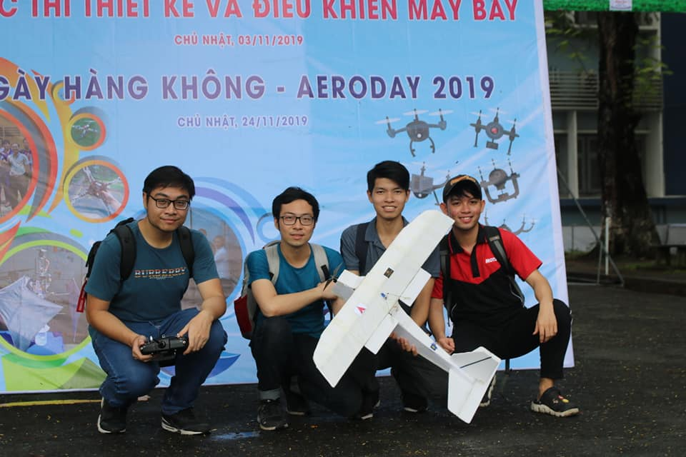
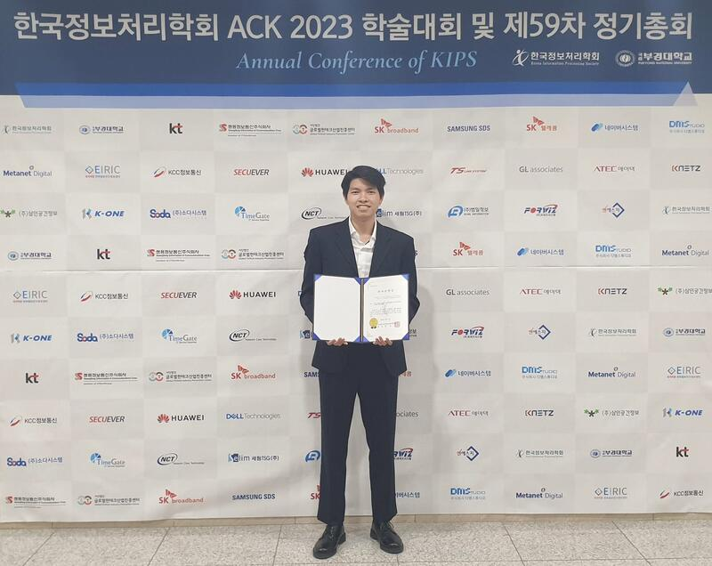
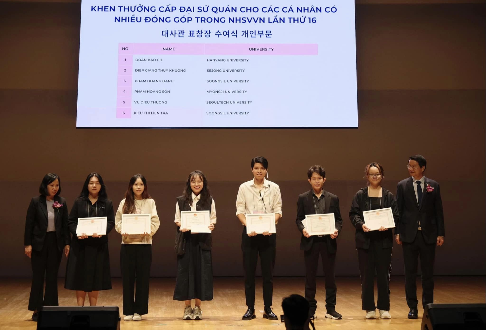

Hi, I'm Diep Giang Thuy Khuong, but you can call me Khuong. I hold a dual academic background, with a bachelor's degree in Aerospace Engineering and currently pursuing a master's degree while working as a graduate research assistant at the Human-Computer Interaction Lab, Sejong University. In essence, I would describe myself as honest, responsible, and resilient person. When faced with challenges, I openly admit when I don't know something but proactively seek solutions. I am committed to meeting deadlines, and my can-do attitude enables me to thrive even under high-pressure situations.

My life motto is: ”You only fail when you stop trying”

---
### History and Experience
During my undergraduate education, I realized I have a passion for Artificial Intelligence, and want to use it to tackle real-world problems. This passion motivated my decision to pursue postgraduate education, leading me to enroll in the Master’s program in a different major after completing my Bachelor degree in 2021. Therefore, my expertise includes 3D modeling and structural analysis using tools such as Solidworks, Abaqus and ANSYS, etc. Additionally, I am proficient in programming language such as Python, MATLAB and some frameworks encompassing Pytorch, Tensorflow, Keras and hands-on experience with Linux, ROS, Unreal Engine.

Regarding my experience, my research topic in my Master program is Vision-based Drone Obstacle Avoidance using Deep Reinforcement Learning. On the other hand, Designing of Delivery Drone was the topic of my graduation thesis in my undergraduate program. 

    

        <iframe src="https://drive.google.com/file/d/1HexY4Ni-ji5Qaq-5C1UBHMlCBt2SsrEX/preview" 
        frameborder="0" 
        allow="accelerometer; encrypted-media; gyroscope; picture-in-picture"
        allowfullscreen></iframe>
    

<em>Drone Navigation in my Thesis</em>

My accomplishments include winning a Consolation prize in the Aeroday 2019 Aircraft Design and Control Competition (ranked 4th/11 teams). I was also granted a Scholarship for Standout Students with Disadvantaged Background by Kumho Asiana-Vietnam Scholarship and Cultural Foundation from 2019 until graduation. I graduated from university with an excellent degree and was in the top 3% of the best students in the Faculty of Transportation Engineering (Top 4/150 students). 

*Aeroday Contest - 2019 ([Link](https://oisp.hcmut.edu.vn/en/student-life/aeroday-2019-aircraft-design-and-control-competition.html))*

During my Masters course. I overcomed unexpected setbacks (the program of the previous Korean student disappeared) and completed the six-year drone project. I spent a lot of effort to study and comprehend the process of training a drone using DRL in simulation, starting from scratch, and subsequently deploying it in a real-world scenario within 8 months. Despite the initial obstacles, my commitment and diligent efforts paid off. My drone was able to navigate through 5 obstacles. It achieved a 90% success rate in simulation and 80% when deployed in the real world on a Bebop drone after fine-tuning with real-world images. I also recently won the Outstanding Paper Award (우수 논문상) given by the Annual Conference of KIPS 2023 (Korean conference).

    

        <iframe src="https://drive.google.com/file/d/1Y--veh5GVBX9qrAlVKHr0992n-hgSmei/preview" 
        frameborder="0" 
        allow="accelerometer; encrypted-media; gyroscope; picture-in-picture"
        allowfullscreen></iframe>
    

<em>Drone Obstacle Avoidance in my Project</em>

*The Annual Conference of KIPS 2023*

In addition to my academic achievements, I actively participate in social activities to expand my network and enhance soft skills. I played a key role in organizing events such as the GALA DINNER - TET XA 2023, the 9th Annual Conference of Vietnamese Young Scientists (ACVYS 2023), the VSAK Sport Woori Bank Union Cup 2023, and the 16th Vietnamese Student day in Korea. For my outstanding contributions, I received merits from the Vietnam Embassy in Korea, and the Vietnamese Students’ Association in Korea.

*Merit for individual with outstanding contribution from Vietnam Embassy in Korea*

*GALA DINNER - TET XA 2023*

  

     

