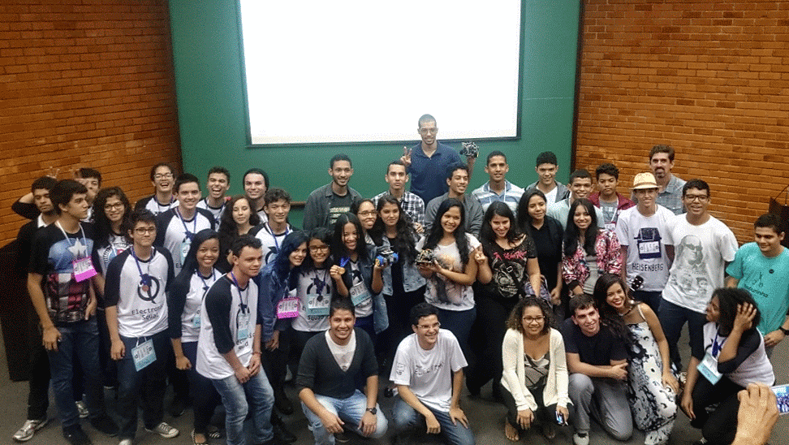
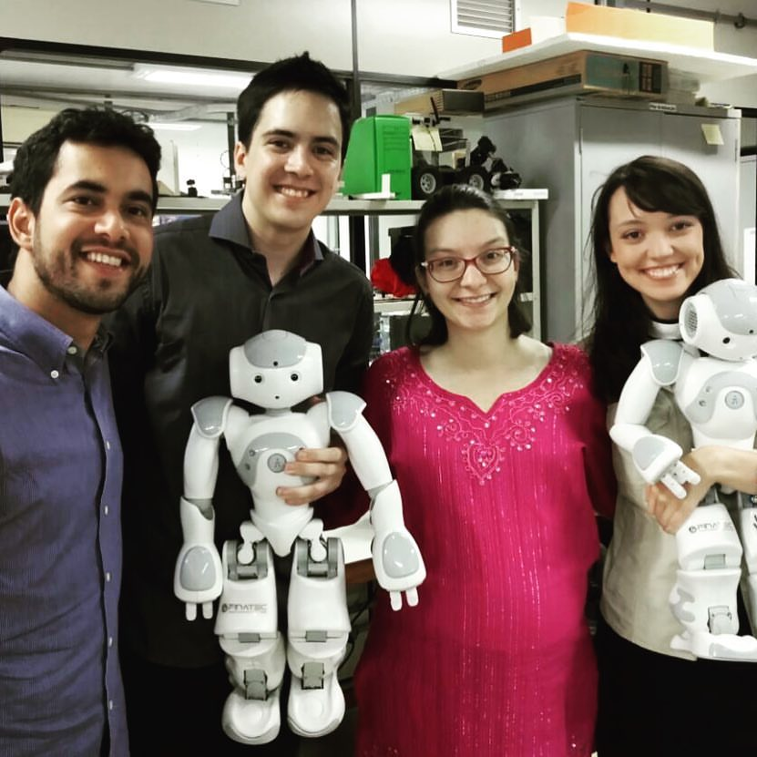

Khuong G. T. Diep is passionate about AI development and application. He is currently pursuing a Master’s degree at Sejong University and working as a Graduate Research Assistant in the Human-Computer Interaction lab. His research currently focuses on Vision-based Deep Reinforcement Learning for Drone Obstacle Avoidance.

During his undergraduate education, Khuong realized he had a passion for Artificial Intelligence, and wanted to use it to tackle real-world problems. This passion motivated his decision to pursue postgraduate education, leading him to enroll in the Master’s program after completing his Bachelor of Engineering in Aerospace Engineering in 2021. He graduated from the university with a very-good degree and at the top 3% of students in the Faculty of Transportation (Top 4 out of 150 students).

His life motto is: ”You only fail when you stop trying”

---
### My History

My academic path 

*Electron Project - 2016*

As a way to provide to children in need a chance to interact with real robots, we created the UnBeatables outreach project, where we performed ludic presentations in public schools and children hospitals.

    

        <iframe src="https://drive.google.com/file/d/1HexY4Ni-ji5Qaq-5C1UBHMlCBt2SsrEX/preview" 
        frameborder="0" 
        allow="accelerometer; encrypted-media; gyroscope; picture-in-picture"
        allowfullscreen></iframe>
    

<em>UnBeatables Outreach Project</em>

By the end of 2016, I was granted the title of Bachelor’s degree due to the conclusion of the Mechatronics Undergraduate Program with major on Control and Automation. Our dissertation was about controlling two arms of a humanoid robot using the cooperative dual task-space. Using the description of the cooperative dual task-space using unit dual quaternions, our goal was to implement on a simulated system and, later on, on a physical platform different task controllers aiming the execution of a common activity regarding house service: carrying and positioning a tray using both arms.

*Photo after presenting our Bachelor Dissertation*

From August 2016 to July 2017, I worked as a software developer at the company Moringa Digital. There I was able to apply all my knowledge about programming and project management, while also learning several new technologies.

In August 2017 I was selected by the Korean Government Scholarship Program (KGSP) which gave me the opportunity to continue my research as a Master's degree student at Sungkyunkwan University. Before starting my Master's Degree, I studied Korean Language at Konyang University for 1 year. In September 2018, I started my Master's course in Electrical and Computer Engineering at SKKU.

I am currently a member of the Control and Robotics Lab and my research is about Semantic Simultaneous Localization and Mapping (Semantic SLAM) on highly dynamic environments.
